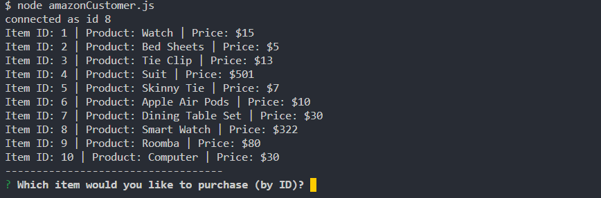
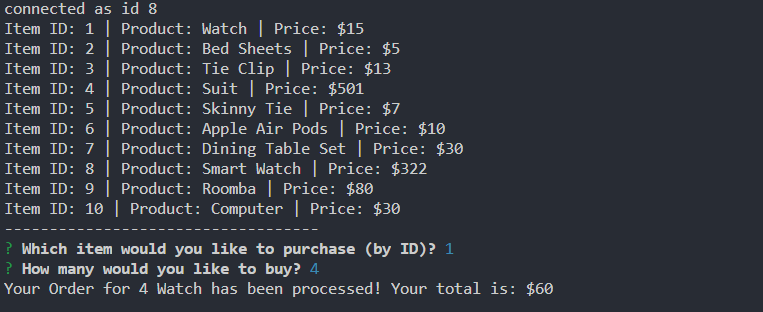

# Command Line Store Front
 The user can choose an item to buy (1 of 10) and the quantity, the app returns the price of all items. 

## Getting Started
https://github.com/CookdLobsta/commandline-customer-app

## Screen Shots

## Technologies used
- Node.js
- SQL
